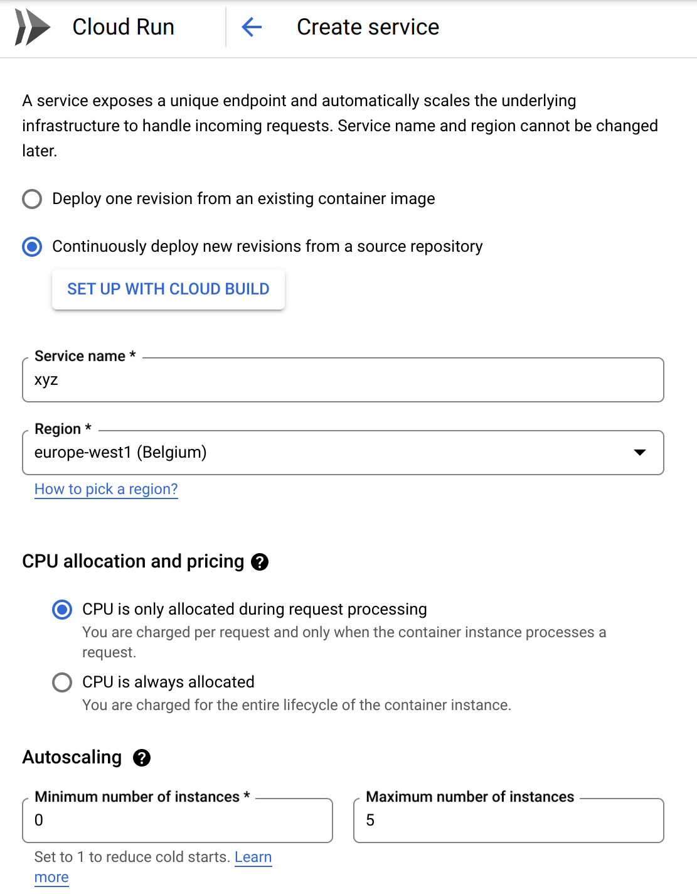
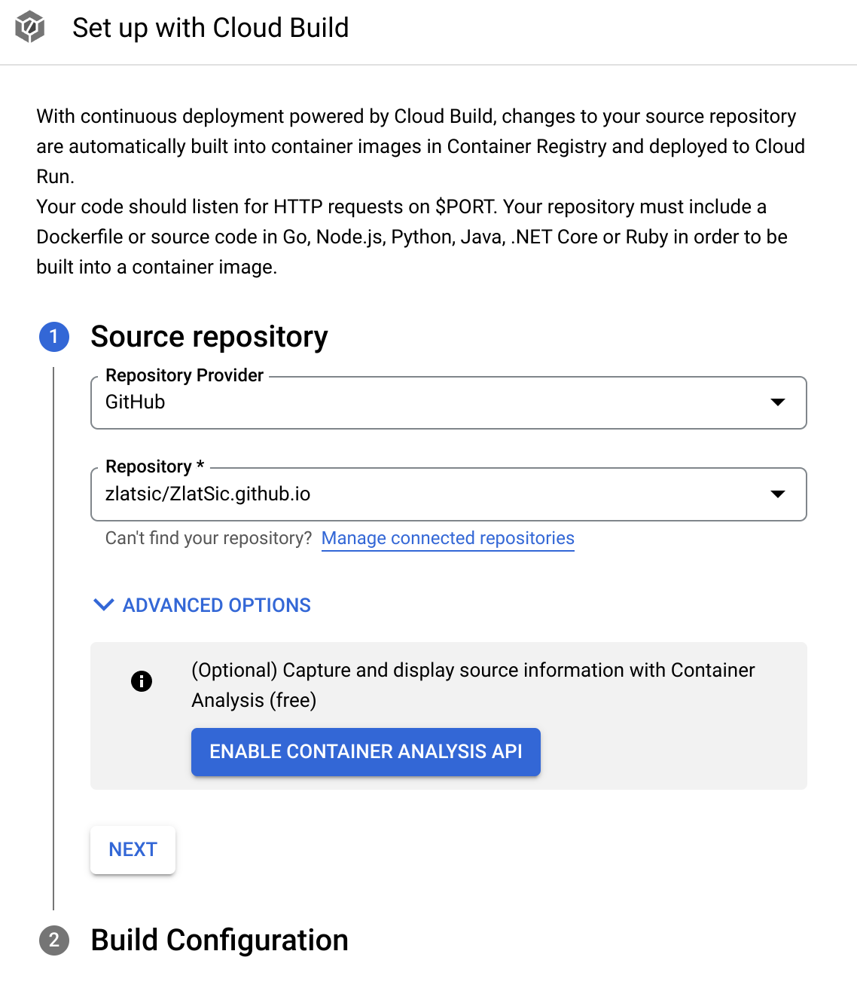
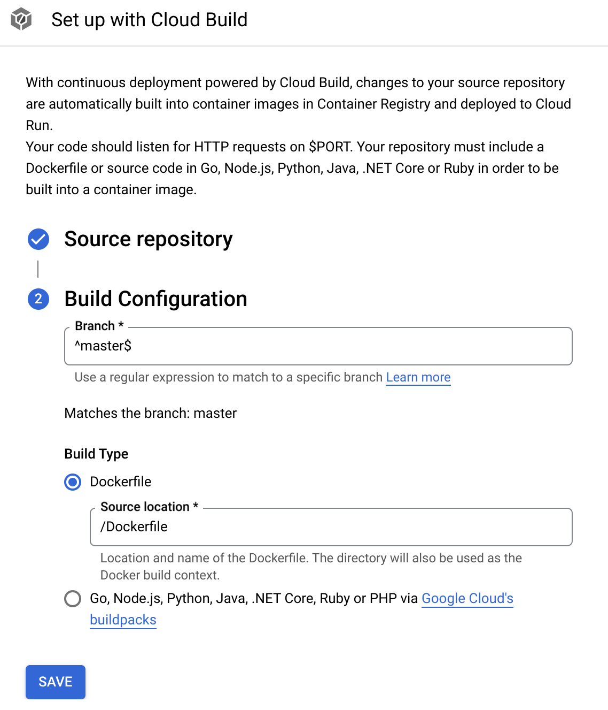
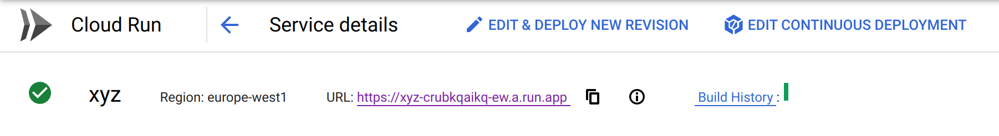
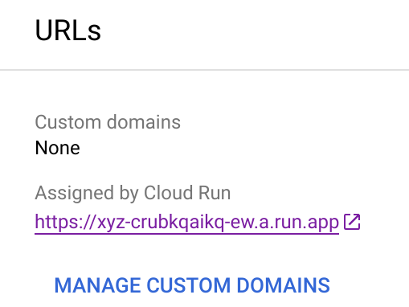
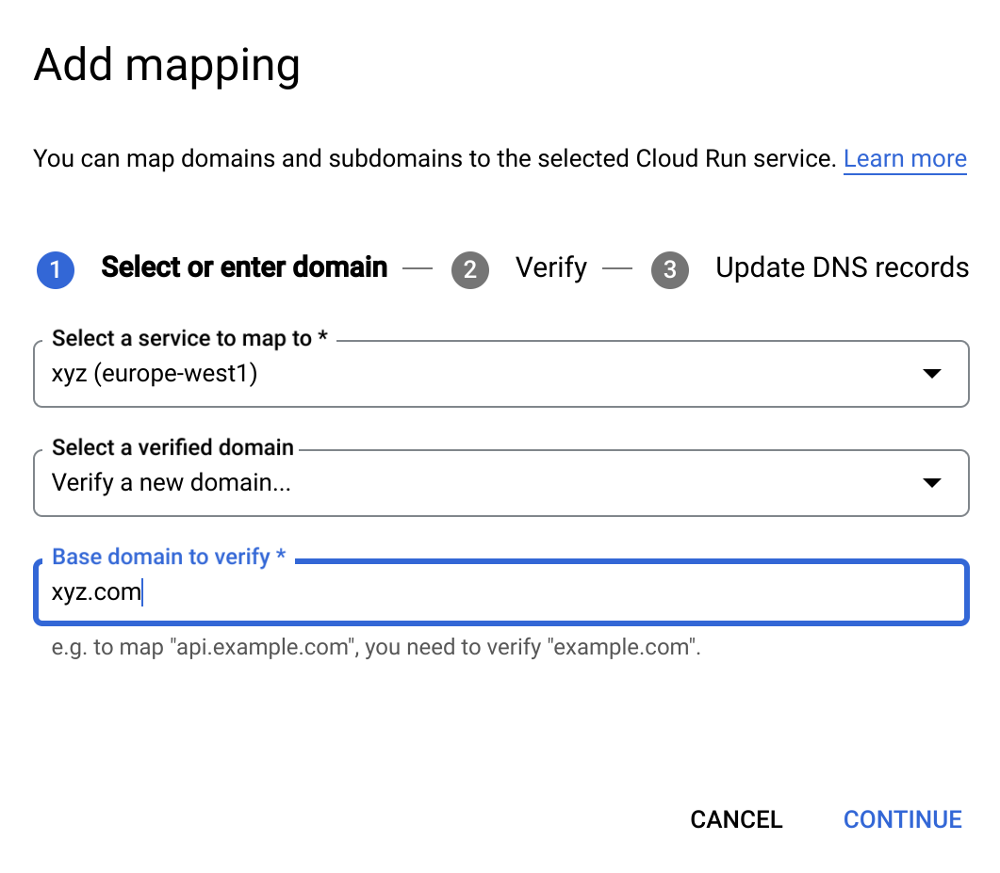
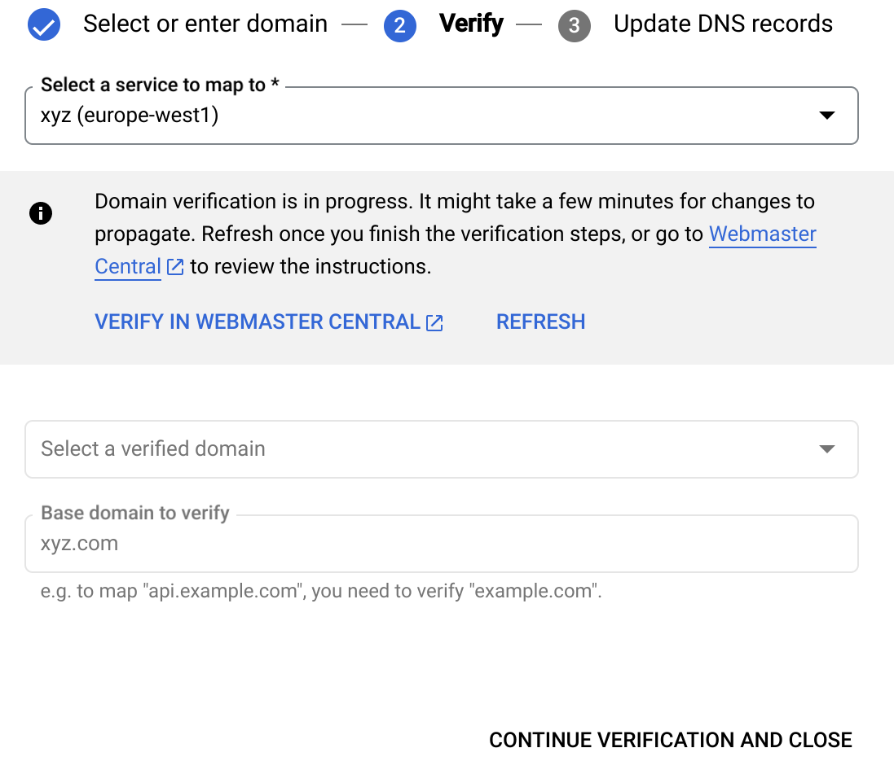

# {{$frontmatter.title}}

Earlier this year I have switched from hosting this site on GitHub pages to the
Google Cloud Platform (GCP). While I admit that this might be an overkill for a
simple blog/portfolio site, this was mostly for educational purposes and it
served those purposes well. To add, since I barely get any traffic here, GCP is
effectively free.

The experience taught me to deploy custom Docker-based applications, assign
domains to them, and set up pipelines for continuous deployment of the whole
project. In this post I will go over the details of the whole setup.

## Dockerizing the site

This was probably the simplest part of the setup - I needed to host this site
in a Docker container. For the image I chose nginx, as I also need a proper
server to host everything. Regarding content, it is static files, so no complex
routing or reverse proxy rules were needed.

The Dockerfile ended up installing dependencies and building the vuepress
project, [available in the
repo](https://github.com/zlatsic/ZlatSic.github.io/blob/master/Dockerfile). The
[nginx
configuration](https://github.com/zlatsic/ZlatSic.github.io/blob/master/nginx.conf)
is also copied, and the project is build to the location where nginx expects
the files. Nginx is expected to be ran with the default settings, while its
configuration is overwritten. Make sure to either run the nginx on port 8080,
or set the envorinoment variable `$PORT` to the port number of the site (or set
up GCP Cloud run to the correct port).

## Setting up Cloud run

GCP Cloud run is a service that hosts a containerized app. The service can be
configured to use a custom docker image (providing an URL to, e.g. dockerhub),
or by building an image from a source repository. Configuration allows users to
specify how many containers can run in parallel, how many requests per
container, etc.

    

For my setup, I chose building from the source, with appropriate limitations to
the number of requests and containers. Since I am building from source, and I
haven't connected my source repo with the Cloud run instance, I still couldn't
access the built site, but this will change in the next step. Notice that the
new service cannot be created, before clicking and setting up Cloud build.

## Setting up Cloud build

Clicking the "Set up with Cloud build" button allows creation of a new
depoloyment pipeline. This pipeline will connect the repo with the Cloud run
instance and, on different trigger events, the repo will be checked out, built,
and used by the service.

    

Different trigger events can be set up, the simples one for my purposes being
on push events to the master or some other branch. This also requires setting
up the GitHub end, but that mostly meant just giving GCP application access to
the repo.

These pipelines can be configured in different ways, I ended up using the Cloud
Build configuration file, written inline in the app, because that allowed me to
simply use default settings. The file can also be edited in the browser app.

    

After this step, the Cloud run service setup can be completed. After the
service is created, its dashboard will be opened. Wait until the configured
build process completes. If interested, its console output should be available
in the Cloud build dashboard.

    

After the build is completed, on the Cloud run service dashboard, there should
be a field named "URL", which is the URL at which the newly deployed app can be
accessed. This address is set up internally by GCP, looking something like
`https://service-name-instance-id-ez.a.run.app/`. Normally, we don't want our
service to be hosted on such an unusual domain, so we need to set up our own.

## Domains

The domain setup is relatively straight forward - next to the URL field in the
Cloud run dashboard, there is a small rounded, clickable "i" sign, that shows
more domain details when opened. It also allows custom domain management.

    

    

    

Custom domains are defined as mappings between the service and the domain.
Write the name of the domain and verify it by following the described steps
(this will involve some actions on yout domain provider's side). After the
domain is verified, DNS records need to be set up. I set up my A and AAAA
records after looking up the addresses for GCP.

After that, everything should be set up and the app available over the
configured domain. Enjoy your hosted service!

# Conclusion

As mentioned in the intro, this was more of an educational experience than an
actual technical need. Still, it has some very concrete, educational use. This
will work with any application that can be hosted in a docker container, unlike
Github pages which acts as a static file server. Continuing the education, I
would perhaps like to extend my experience by using fewer GUI tools and
focusing on the CLI. This would also include configuring everything over YAML
files in the repo.

<disqus />
